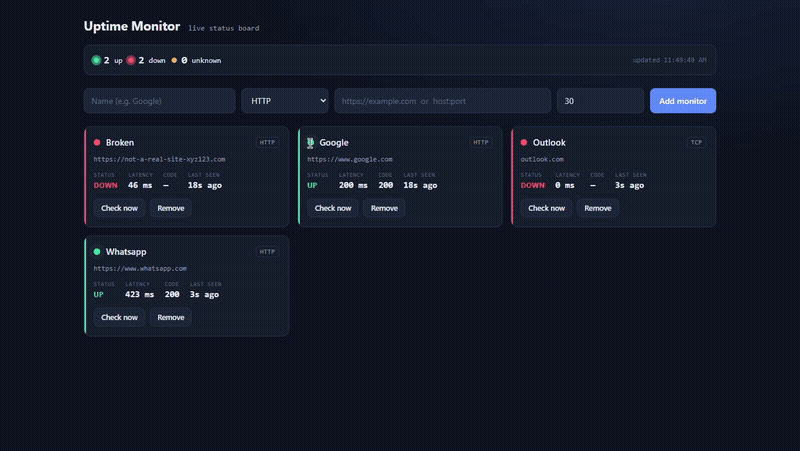
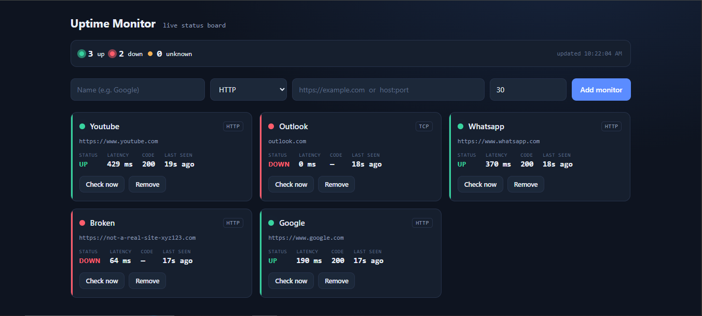

## Demo



# Uptime Monitor

A backend service that monitors the availability of websites and network endpoints, built with **Spring Boot 3** and **Java 21**. It runs scheduled health checks against registered targets, records their status and response latency, exposes the data through a REST API and a live dashboard, and ships production-style operational metrics via Prometheus.

> Scheduled HTTP/TCP health checks · PostgreSQL + Flyway · Actuator/Prometheus metrics · Dockerized · live status dashboard

---

## Features

- **Monitor management** — create, list, and delete monitors through a REST API. Each monitor targets a URL (HTTP) or a host/port (TCP).
- **Scheduled health-check engine** — a background scheduler probes every monitor on an interval, recording whether it is `UP` or `DOWN`, the HTTP status code, and the response latency in milliseconds.
- **Live dashboard** — a status board served by the app shows every monitor with its current state and controls to add, check, and remove monitors, with auto-refresh.
- **Database-backed** — monitor definitions and check results are persisted in PostgreSQL, with schema managed by Flyway migrations.
- **Operational metrics** — Spring Boot Actuator with Micrometer exposes health and Prometheus-format metrics for scraping.
- **Fully containerized** — one `docker compose up` brings up the app and its database together; a no-Docker profile using embedded H2 is available for quick local runs.
- **Tested** — JUnit 5 unit and integration tests.

## Tech stack

| Layer | Technology |
|---|---|
| Language | Java 21 |
| Framework | Spring Boot 3.3 (Web, Data JPA, Scheduling, Actuator) |
| Database | PostgreSQL (production) · H2 (local, no-Docker) |
| Migrations | Flyway |
| Metrics | Micrometer + Prometheus |
| Build | Maven (with Maven Wrapper) |
| Containers | Docker + Docker Compose |
| Testing | JUnit 5 |

---

## Getting started

### Option A — Docker (recommended)

Requires Docker Desktop. From the project root:

```bash
docker compose up --build
```

This starts the application and a PostgreSQL database together. Once it's running, open:

- Dashboard: http://localhost:8080
- Health: http://localhost:8080/actuator/health
- Prometheus metrics: http://localhost:8080/actuator/prometheus

To stop and clear the database volume:

```bash
docker compose down -v
```

### Option B — No Docker (embedded H2)

Runs the app on its own with an in-memory database — no PostgreSQL or Docker needed. Uses the Maven Wrapper, so you don't need Maven installed.

**Windows (PowerShell):**

```powershell
.\mvnw.cmd spring-boot:run
```

**macOS / Linux:**

```bash
./mvnw spring-boot:run
```

Then open http://localhost:8080.

---

## API

Base path: `http://localhost:8080/api/monitors`

| Method | Endpoint | Description |
|---|---|---|
| `GET` | `/api/monitors` | List all monitors and their latest status |
| `POST` | `/api/monitors` | Create a new monitor |
| `POST` | `/api/monitors/{id}/check` | Run a check for one monitor immediately |
| `DELETE` | `/api/monitors/{id}` | Delete a monitor |

### Example: add a monitor

**curl (macOS / Linux):**

```bash
curl -X POST http://localhost:8080/api/monitors \
  -H "Content-Type: application/json" \
  -d '{"name":"Google","url":"https://www.google.com"}'
```

**PowerShell (Windows):**

```powershell
Invoke-RestMethod -Method Post -Uri http://localhost:8080/api/monitors `
  -ContentType "application/json" `
  -Body '{"name":"Google","url":"https://www.google.com"}'
```

The scheduler then probes it automatically, and the result appears on the dashboard with its status (`UP` / `DOWN`), latency, and status code.

---

## Dashboard

The app serves a live status board at the root URL. It lists every monitor with its current state and lets you add, check, and remove monitors without touching the API directly.



---

## Monitoring & metrics

Spring Boot Actuator is enabled, exposing:

- `GET /actuator/health` — application and database health
- `GET /actuator/prometheus` — metrics in Prometheus scrape format

This makes the service ready to plug into a Prometheus + Grafana stack for dashboards and alerting.

---

## Project structure

```
uptime-monitor/
├── src/
│   ├── main/
│   │   ├── java/com/site/uptime/   # controllers, services, scheduler, entities
│   │   └── resources/
│   │       ├── db/migration/       # Flyway migrations
│   │       ├── static/             # dashboard (index.html)
│   │       └── application.yml     # configuration
│   └── test/                       # JUnit 5 tests
├── docker-compose.yml
├── Dockerfile
├── pom.xml
└── mvnw / mvnw.cmd                 # Maven Wrapper
```

---
